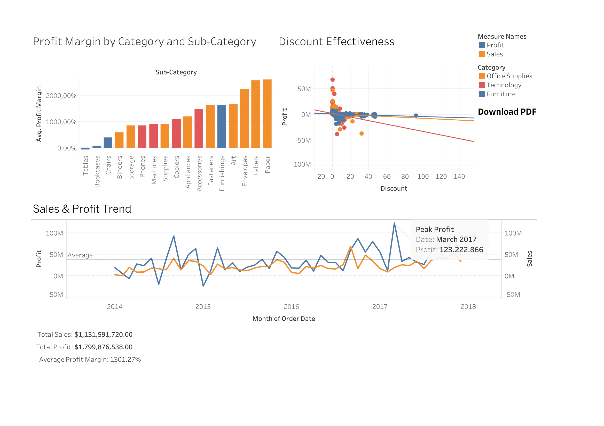

# Superstore Analysis (Python, Tableu)

This project analyze supertore dataset sales, profit, customer behavior with the help of python. open `notebook.ipynb` to see the data cleaning and exploration steps. You can find the dataset [here](https://www.kaggle.com/datasets/vivek468/superstore-dataset-final/data)

## Tools & Technologies
- Python (pandas, matplotlib, seaborn)
- Tableau (interactive dashboard)
- Jupyter Notebook

## Key Insights
- Profit margin trends across categories and sub-categories
- Impact of discounts on profitability
- RFM analysis to segment customers by purchasing behavior
- Regional and segment-based performance analysis

## Dashboard Preview
Here is a few insight that i can put it into tableu.

you can access [here](https://public.tableau.com/app/profile/reizidan.kharisma/viz/Superstore_17567271454840/Dashboard2m) to interact with the dasboard